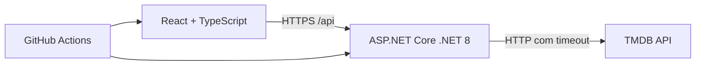

# CineSearch

Aplicação full-stack para descobrir filmes e séries usando a API do TMDB. O projeto foi pensado como portfólio: frontend responsivo em React/TypeScript e API .NET 8, ambos containerizados e com CI.

> Dados e imagens fornecidos pelo [TMDB](https://www.themoviedb.org/). Este produto usa a API do TMDB, mas não é endossado ou certificado pelo TMDB.

## O que é possível fazer

- Buscar filmes, séries ou ambos, com paginação.
- Descobrir títulos por tipo, gênero, ano, nota mínima e ordenação.
- Consultar sinopse, elenco, criador/diretor, duração, temporadas, orçamento e bilheteria.
- Assistir ao trailer no YouTube quando o TMDB o disponibiliza e explorar recomendações.
- Receber feedback claro quando o catálogo estiver indisponível.

## Arquitetura



## Execução local

Pré-requisitos: .NET SDK 8, Node.js 20+ e uma chave de API v3 do TMDB.

1. Copie `src/MovieAPI.API/appsettings.Development.json.example` para `appsettings.Development.json` e preencha `TmdbSettings:ApiKey`.
2. Em um terminal, execute `dotnet run --project src/MovieAPI.API --launch-profile http`.
3. Em outro terminal, execute `cd frontend`, `npm ci` e `npm run dev`.

O frontend abre em `http://localhost:5173` e a API em `http://localhost:5171`.

### Docker

Copie `.env.docker` para `.env`, defina `TMDB_API_KEY` e execute:

```bash
docker compose up --build
```

O frontend fica em `http://localhost:5173` e a API em `http://localhost:5000`.

## Qualidade

```bash
dotnet test MovieAPI.sln
cd frontend
npm run lint
npm run test -- --run
npm run build
```

O workflow em `.github/workflows/ci.yml` executa testes, lint, builds e valida as duas imagens Docker em cada pull request e push para `main`.

## Deploy gratuito

1. Crie a API pelo blueprint `render.yaml` no Render. Configure `TmdbSettings__ApiKey` e `Cors__AllowedOrigins__0` com a URL final do frontend.
2. Importe a pasta `frontend` no Vercel ou Netlify. Configure `VITE_API_URL` com a URL HTTPS da API **no momento do build**.
3. Após publicar, valide `/health`, busca, filtros, detalhes, trailer e recomendações no navegador.

Nenhuma chave deve ser adicionada ao repositório. Inclua os links públicos desta seção após criar as contas de deploy.
